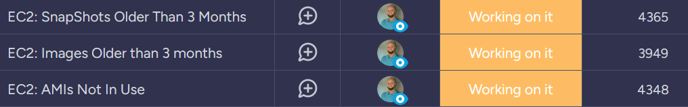
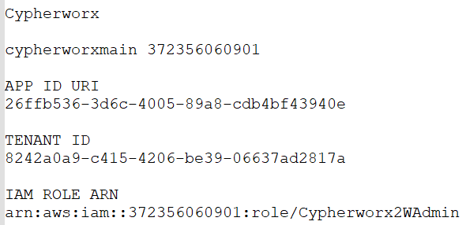
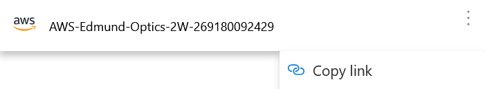
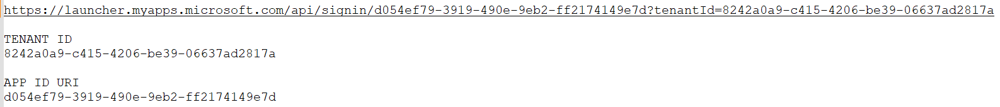
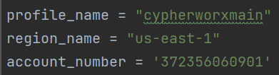

# CHscripts

[Introduction](#introduction) 
[ch-getresources](#ch-getresources.py) 
[ch-parsley.py](#ch-parsley.py) 
[Installation](#installation) 
[Authentication](#authentication) 
[Usage](#usage)

## Introduction

This repository contains helper scripts for the 2nd Watch ROC Cloud Health project. These scripts are meant to speed up the process of verifying information gathered by the Cloud Health policies. Some clients have thousands of resources to be verified - ain't nobody got time for that.

 
_Working on it... but not by hand._

## ch-getresources.py
Work in progress!

Complete functions:
- Old AMIs
- Unused AMIs
- Old EBS snapshots
- Old RDS/Aurora snapshots
- Old unattached volumes

In progress:
- Unattached EIPs

## ch-parsley.py
Work in progress!

Actions:
- Reads from cypherworxmain-us-east-1-old-images.csv and makes Cypherworx-RAW.xlsx
- Reads from Cypherworx-RAW.xlsx and compares policy-alert-2023-04-28-9345855749691.csv

---- Cypherworx-RAW.xlsx ----

The script will grab info from the AWS generated csv 'cypherworxmain-us-east-1-old-images.csv' and check to see if an AMI was created within the last 90 days. If so, it will copy that entry from the 'main-us-east-1-old-images' sheet to either the 'false-alarms' or 'valid-alarms' sheets.

---- Cypherworx-Matching.xlsx ----

The script verifies if info from Cypherworx-RAW.xlsx sheet 'main-us-east-1-old-images' and info grabbed from CloudHealth 'policy-alert-2023-04-28-9345855749691.csv' match. If they do, they go to the 'matched' sheet, else they go to the 'unmatched' sheet.

## Installation

Prerequisites:
- AWS CLI: [Installing the AWS Command Line Interface](https://docs.aws.amazon.com/cli/latest/userguide/getting-started-install.html)
- Python: [Download Python](https://www.python.org/downloads/) 

Before running any scripts, install the required non-default Python packages: `pip install -r /path/to/requirements.txt`. This is best done in a separate virtual environment for this script, so that these packages don't mess with any other packages in your OS. Don't go down the dependencies rabbit hole, it's not a good place to be.

Set up a local text document to store information for the accounts into which you will be authenticating. You will need at least a profile name, account number, Tenant ID and App ID URI for each AWS account you intend to access.

 
_The ARN may not be needed._

Authentication will be through `aws-azure-login`. Perform these steps from the terminal in your IDE; I use PyCharm and the Git Bash terminal because I'm weird, but this should work fine in VS Code and a Powershell/command prompt terminal too. You could even run these commands in a standalone terminal window from within the folder that contains these scripts, and use a basic text editor where needed, but are you _really_ that kind of heathen? 

- Follow the `aws-azure-login` [installation instructions](https://github.com/aws-azure-login/aws-azure-login#installation):
  - You will need to install Node.js
  - If installing on Windows, you probably don't need the Node.js optional extra packages like Chocolatey
  - You will probably also not need the `puppeteer` dependency mentioned in the `aws-azure-login` installation instructions

## Authentication 

- Create configuration profiles (as needed):
  - Use the command `aws-azure-login --configure --profile foo`; replace 'foo' with some name you will remember (for example, 'cypherworxmain').
  - You will need the Azure Tenant ID and App ID URI. For many/most of our clients, start typing their name or enter the appropriate account number in the search bar in My Apps. When you find the correct account, click the three dots on the right to get the popup menu (_don't_ click on the account like you normally would to log into the AWS console) and click on `Copy link`:
    
    _Seriously, don't click on the account name._  
  - Paste the link in your local account information document. The Tenant ID will be after `?tenantId=` and the App ID URI is between `signin/` and `?tenantId=`:
    
    _If you can't at least find the Tenant ID, there's no hope for you._
  - It can be helpful to know the ARN of the role you assume when you log in to the account you're setting up, but it shouldn't be necessary. If you encounter errors, repeat this process after finding the ARN.
  - Note that this information is account-specific; multiple AWS accounts for the same client will have different Tenant IDs and App ID URIs. As such, a separate `aws-azure-login` profile will need to be configured for every account.
  - You will only need to configure the profile for any given AWS account once; the configuration information will be stored in your local `.aws/config` file.
- Log into an account:
  - Use the command `aws-azure-login --profile foo` and replace 'foo' with the appropriate account profile name (this is where it's helpful to have that doc with info for every profile).
  - You will be prompted for a password. This is the same password you use to log into My Apps.
  - Assuming you entered your password correctly, you will be sent an approval push notification via Microsoft Authenticator. Approve the sign-in, and you will be authenticated into the account.

## Usage

At this point, you are almost ready to use the `ch-getresources.py` script. Within the script, near the top, you will need to change three pieces of information:
- `profile_name`
- `region_name`
- `account_number`

 
_This may change to become more automated in the future._

Once those variables match the account you are in, run the script with your IDE's run function, or in the terminal with `python ch-getresources.py`. The script will generate `.csv` files in the directory in which the script resides.
